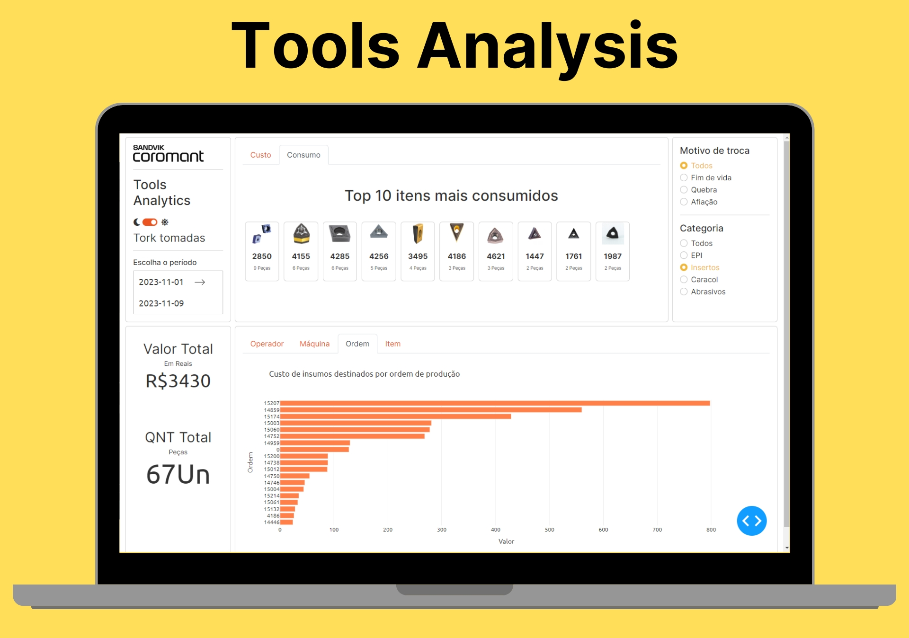

# Dashboard para Monitoramento de Consumo de Insumos para Usinagem

## Descrição
Este projeto é uma aplicação Python desenvolvida para monitorar o consumo de insumos na usinagem, utilizando dados da API do sistema CoroPlus® da Sandvik. A aplicação permite visualizar detalhadamente dados de consumo e custos com ferramentas, oferecendo insights valiosos para otimização de recursos e processos. Ainda há muitos dados e funcionalidades novas a serem implementadas. Vale lembrar que para funcionar deverá ter acesso as credenciais para a API do CoroPlus®.
 <p  align="center">



</p>

## Funcionalidades
- **Monitoramento de Consumo por Funcionário:** Visualize o consumo e custos de ferramentas usinadas por cada funcionário.
- **Filtragem de dados:** Filtre dados por preiodo, por motivos de troca etc.
- **Dados por Máquina:** Acompanhe o uso de insumos por diferentes máquinas.
- **Análise por Ordem de Produção:** Obtenha dados de consumo relacionados a ordens de produção específicas.
- **Detalhamento por Item Usinado:** Veja informações detalhadas do consumo por cada item usinado.

## Tecnologias Utilizadas
- Python
- Dash (para a interface de usuário)
- Plotly (para gráficos interativos)
- Dash Bootstrap Components
- Dash Bootstrap Templates
- Python-dotenv (para gerenciamento de variáveis de ambiente)

## Configuração e Instalação
Para configurar e executar o projeto, siga as instruções abaixo:

1. **Clone o Repositório:**
   ```bash
   git clone https://github.com/ismael-figueiredo/Dashboard-Tools-Analysis.git

2.  **Configuração do Ambiente Virtual (Opcional):**
    
    ```bash
    python -m venv venv
    source venv/bin/activate  # No Linux/macOS
    venv\Scripts\activate    # No Windows
    
3.  **Instalação das Dependências:**
    
     ```bash 
     pip install -r requirements.txt
    
4.  **Configuração das Variáveis de Ambiente:** Crie um arquivo `.env` na raiz do projeto e configure as variáveis necessárias conforme o arquivo `.env.exemple`
    
5.  **Execução da Aplicação:**


    ```bash 
    python index.py
    

## Uso

Após iniciar a aplicação, acesse a interface do usuário através do navegador no endereço indicado (geralmente `http://localhost:8052`). Utilize os recursos da interface para visualizar e analisar os dados de consumo.

## Suporte e Contribuições

Para suporte, entre em contato. Contribuições para o projeto são bem-vindas. Por favor, leia as diretrizes de contribuição antes de fazer um pull request.
